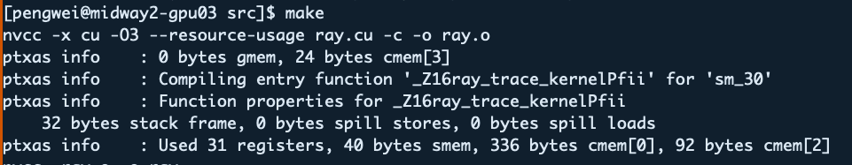
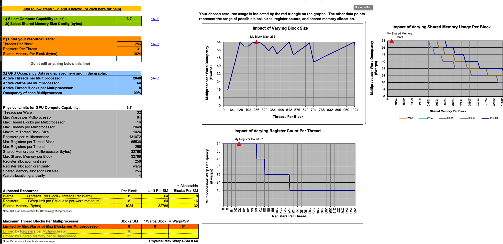
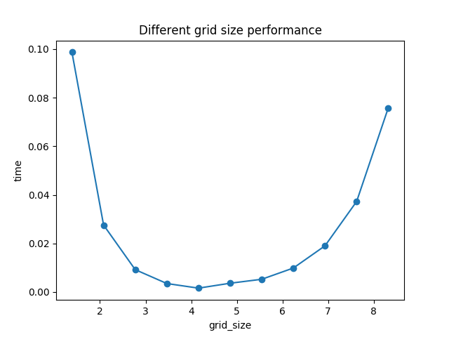
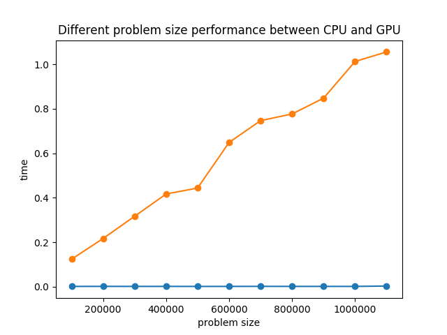
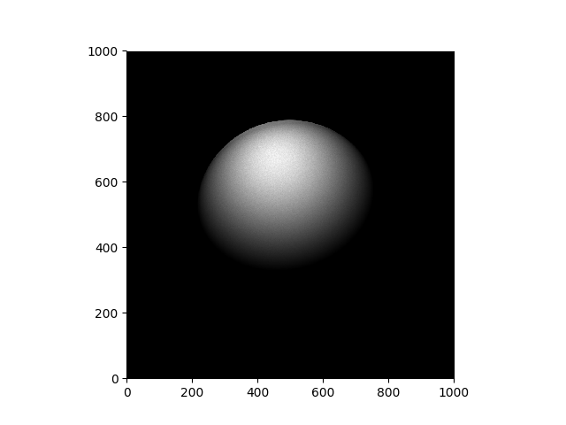

# Ray tracing on CPU VS GPU

## CPU code for ray tracing

- CPU_version
    - src
    - build
    - cmakeLists.txt

### To compile the code

```
cd build
cmake .. -DCMAKE_C_COMPILER=gcc -DCMAKE_BUILD_TYPE=Release
make all
```
- build
    - ray_par parallel version 
    - ray_ser serial version
    - plot.py script to plot the graph

### To run the program
```
-r number of rays
-g length of the grid window
```

## GPU code for ray tracing

- src
    - Makefile
    - ray.cu
    - plot.py
    - run_ray_trace.sbatch

### To compile the code

```
cd src
make
```
- src
    - ray
### To run the program

```
-g grid_dim
-b block_dim
-r number of rays
-l length of the window
```

## Optimal setting for cuda code

When compiling the cuda code, the compiler report the Registers per Thread is 31. 



Then use the CUDA Occupancy Calculator to do the calculation. It shows that block size of 256 is a good choice. 



If we keep the block size 256, use different grid size from 2^3, 2^4, 2^5, 2^6, 2^7, ... 2^15, with 1 million rays. we can have the following performance graph.



From the graph, we can tell that the optimal grid_size is 64. So the optimal config for cuda runtime is grid_size 64, block_size 256, with 1 million of rays.

### Compare the runtime of CPU version and CUDA GPU version

Run the CPU version and GPU version with problem size from 100000, ... 1100000. we have the following result:



With linearly increasing problem size, we can tell that the CPU version's runtime is increasing almost linearly, yellow line in the graph. However, there is not much change in the GPU version, blue line in the graph.

### Show a sample image of 1 billion rays produced by CUDA



### Submission

The compressed submission is `submission.rar.gz`.
